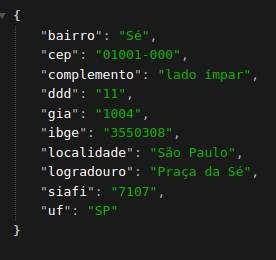

# GOlang ZipCode Search

[](https://github.com/franciscoklaus/golang-buscacep/releases)

## Overview

GO code designed for conducting an address search based on the specified ZIP code.

## Table of Contents

- [Version](#version)
- [Features](#features)
- [Usage](#usage)


## Version

Current Version: v1.1

For a list of all releases and their release notes, see the [Releases](https://github.com/franciscoklaus/golang-buscacep/releases) page.

## Features

- JSON (Marshal and Unmarshal) for efficient data handling
- HTTP requests for seamless communication
- Defer for resource management
- File manipulation for enhanced functionality
- Structs
- Http.ListenAndServe
- Http.HandleFunc

## Usage

```bash
go run main.go

curl http://localhost:8080/?cep=01001000
```
Replace "01001000" with the actual numeric ZIP code you want to query.

Result:

